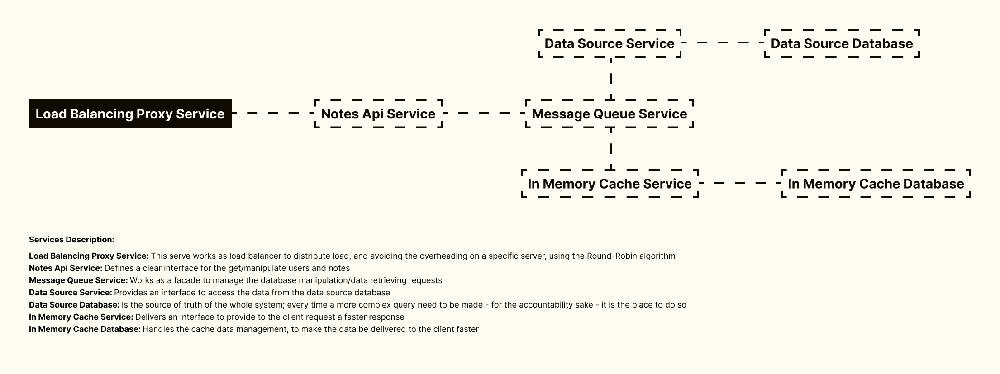

<h1 align="center">
Notes API Service With Ruby On Rails, Groovy, Nim, Crystal, Typescript, Spring Boot, PostgreSQL, Prologue
</h1>

 

 

  <a href="#description">✍️ Description</a> &nbsp;&nbsp;&nbsp;|&nbsp;&nbsp;&nbsp <a href="#endpoints">📌  Endpoints</a> &nbsp;&nbsp;&nbsp;|&nbsp;&nbsp;&nbsp <a href="#topology">🗺️  Topology</a> &nbsp;&nbsp;&nbsp;|&nbsp;&nbsp;&nbsp <a href="#install">🔍 Install</a> &nbsp;&nbsp;&nbsp;|&nbsp;&nbsp;&nbsp <a href="#technologies">🚀 Technologies</a> &nbsp;&nbsp;&nbsp;|&nbsp;&nbsp;&nbsp <a href="#related">♟️ Related</a> &nbsp;&nbsp;&nbsp;|&nbsp;&nbsp;&nbsp <a href="#contact">✉️ Contact</a>

 
 

<h3 id="description">✍️ Description:</h3>

This project is an interesting project. It has the most used design system techniques to make a scalable Api service; if you are in love with creating services like me, this is an excellent repository to study. So, good luck!

 

<h3 id="endpoints">📌  Endpoints:</h3>

<image src="./service_endpoints.png" width="100%"/>

 

<h3 id="topology">🗺️  Topology:</h3>

 

<h3 id="install">🔍  Install:</h3>

To start the service, run the following commands:

**To run the service:**

`./service_starting.sh`

 

<h3 id="technologies">🚀  Technologies:</h3>

To build this project is used:

- Ruby On Rails
- PostgresSQL
- Docker
- Docker Compose
- Docker Desktop
- Redis In-memory Database
- Express Js
- Typescript
- Jest Js
- Prettier
- EsLint
- EditorConfig
- Babel Js
- Crystal Language
- Crystal Spec
- Grip
- Groovy Language
- Spring Boot
- Jackson
- Simple Http
- Nim Language
- Prologue

 

<h3 id="related">♟️  Related:</h3>

See more:

<ul>
  <li><a href="https://github.com/samueldecarvalhodeveloper/Calculator-App-With-Jetpack-Compose-Kotlin-Material-3-JUnit-Mockk-Dagger-2-Coroutines-Ui-Automator">Calculator App With Jetpack Compose</a></li>
  <li><a href="https://github.com/samueldecarvalhodeveloper/Calculator-App-With-React-Native-Expo-Custom-Hooks-Typescript-Async-Storage-Prettier-Eslint">Calculator App With React Native</a></li>
  <li><a href="https://github.com/samueldecarvalhodeveloper/Matrix-Multiplication-Algorithm-With-Haskell-Cabal-Docker-Compose-EditorConfig-Fuctional-Programming">Matrix Multiplication With OCaml</a></li>
</ul>

 

<h3 id="contact">✉️  Contact:</h3>

**Email:**
<a href="mailto:personal.samuelcarvalho@gmail.com">personal.samuelcarvalho@gmail.com</a>

 
 

<strong>Repository Link:</strong>

[https://github.com/samueldecarvalhodeveloper/Notes-API-Service-With-Ruby-On-Rails-Groovy-Nim-Crystal-Typescript-Spring-Boot-PostgreSQL-Prologue](https://github.com/samueldecarvalhodeveloper/Notes-API-Service-With-Ruby-On-Rails-Groovy-Nim-Crystal-Typescript-Spring-Boot-PostgreSQL-Prologue)
